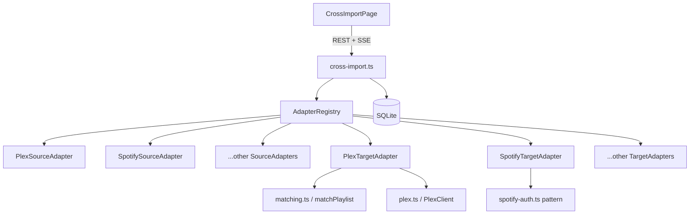
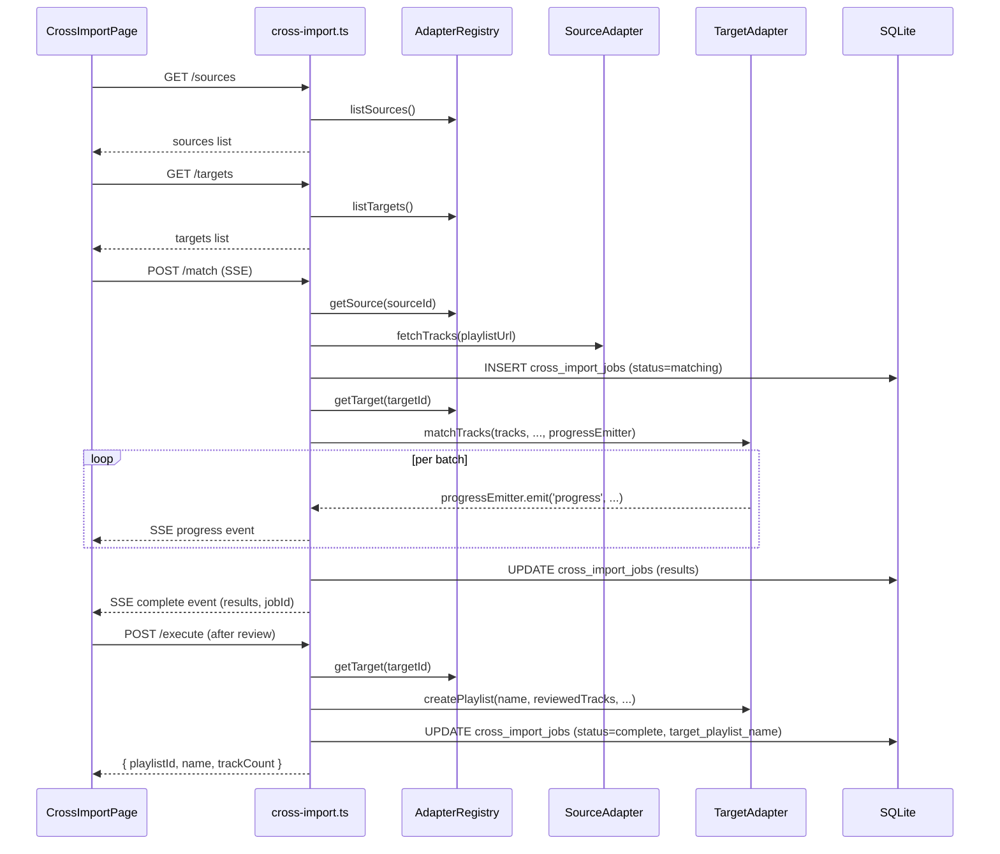

# Design Document: Cross-Playlist Import

## Overview

Cross-Playlist Import is a universal playlist transfer tool built on a pluggable adapter architecture. A user picks any supported service as a source, selects a playlist, picks a write-capable service as a target, and the app matches tracks against the target's catalog, presents a mandatory review screen, then creates the playlist on the target.

The feature is implemented as a new top-level page (`CrossImportPage`) in the web app, backed by a new route file (`apps/server/src/routes/cross-import.ts`) and a set of adapter modules. It reuses the existing SSE progress pattern from `apps/server/src/routes/import.ts`, the existing `matchPlaylist` function from `apps/server/src/services/matching.ts` for Plex targets, and the existing Spotify OAuth pattern from `apps/server/src/routes/spotify-auth.ts` for external targets.

## Architecture

The system is organized around three layers:

1. **Adapter Layer** — `SourceAdapter` and `TargetAdapter` interfaces, one implementation per service, registered in a central `AdapterRegistry`.
2. **Route Layer** — `apps/server/src/routes/cross-import.ts` handles all HTTP endpoints. It delegates to the registry to find the right adapter for each request.
3. **UI Layer** — `CrossImportPage` in the web app drives a step-based flow, consuming the cross-import API endpoints.



## Components and Interfaces

### Adapter Interfaces

```typescript
// apps/server/src/adapters/types.ts

export interface TrackInfo {
  title: string;
  artist: string;
  album?: string;
}

export interface PlaylistInfo {
  id: string;
  name: string;
  trackCount: number;
  durationMs?: number;
  coverUrl?: string;
}

export interface MatchResult {
  sourceTrack: TrackInfo;
  targetTrackId?: string;       // service-specific ID for the matched track
  targetTitle?: string;
  targetArtist?: string;
  targetAlbum?: string;
  confidence: number;           // 0–100
  matched: boolean;
  skipped: boolean;
}

export interface ServiceMeta {
  id: string;                   // e.g. 'spotify', 'plex:server-123'
  name: string;                 // display name
  icon: string;                 // icon identifier
  isSourceOnly: boolean;
  requiresOAuth: boolean;       // for targets
}

export interface SourceAdapter {
  meta: ServiceMeta;
  /** List playlists the user owns/follows (optional — not all sources support this) */
  listPlaylists?(userId: number, db: any): Promise<PlaylistInfo[]>;
  /** Fetch all tracks from a playlist given a URL or ID */
  fetchTracks(playlistUrlOrId: string, userId: number, db: any): Promise<{ playlist: PlaylistInfo; tracks: TrackInfo[] }>;
}

export interface TargetAdapter {
  meta: ServiceMeta;
  /** Search the target's catalog for a track */
  searchCatalog(query: string, userId: number, db: any): Promise<MatchResult[]>;
  /** Match a list of source tracks against the target catalog */
  matchTracks(
    tracks: TrackInfo[],
    targetConfig: TargetConfig,
    userId: number,
    db: any,
    progressEmitter?: NodeJS.EventEmitter,
    isCancelled?: () => boolean
  ): Promise<MatchResult[]>;
  /** Create a playlist on the target service */
  createPlaylist(
    name: string,
    matchResults: MatchResult[],
    targetConfig: TargetConfig,
    userId: number,
    db: any
  ): Promise<{ playlistId: string; name: string; trackCount: number }>;
  /** Initiate OAuth flow — returns the authorization URL */
  getOAuthUrl?(userId: number, db: any, redirectUri: string): Promise<string>;
  /** Handle OAuth callback — stores the token */
  handleOAuthCallback?(code: string, userId: number, db: any, redirectUri: string): Promise<void>;
  /** Check if the user has a valid OAuth connection */
  hasValidConnection?(userId: number, db: any): Promise<boolean>;
  /** Revoke and delete the stored OAuth connection */
  revokeConnection?(userId: number, db: any): Promise<void>;
}

export interface TargetConfig {
  /** For Plex targets: the server URL and library ID */
  serverUrl?: string;
  libraryId?: string;
  plexToken?: string;
  /** For external targets: resolved from stored OAuth connection */
  accessToken?: string;
}
```

### Adapter Registry

```typescript
// apps/server/src/adapters/registry.ts

import { SourceAdapter, TargetAdapter } from './types';

class AdapterRegistry {
  private sources = new Map<string, SourceAdapter>();
  private targets = new Map<string, TargetAdapter>();

  registerSource(adapter: SourceAdapter) {
    this.sources.set(adapter.meta.id, adapter);
  }

  registerTarget(adapter: TargetAdapter) {
    this.targets.set(adapter.meta.id, adapter);
  }

  getSource(id: string): SourceAdapter | undefined {
    return this.sources.get(id);
  }

  getTarget(id: string): TargetAdapter | undefined {
    return this.targets.get(id);
  }

  listSources(): SourceAdapter[] {
    return Array.from(this.sources.values());
  }

  listTargets(): TargetAdapter[] {
    return Array.from(this.targets.values()).filter(a => !a.meta.isSourceOnly);
  }
}

export const adapterRegistry = new AdapterRegistry();
```

Adapters are registered at server startup in `apps/server/src/adapters/index.ts`, which imports each adapter module and calls `adapterRegistry.registerSource` / `adapterRegistry.registerTarget`. Adding a new service means creating a new adapter file and adding one line to `index.ts` — no changes to routing or matching logic.

### Plex Adapters

`PlexSourceAdapter` uses `PlexClient` from `apps/server/src/services/plex.ts` to call `GET /playlists?playlistType=audio`. For Plex Home users it first calls the Plex Home switch-user endpoint (`POST https://plex.tv/api/v2/home/users/{userId}/switch`) to obtain the managed user's token.

`PlexTargetAdapter` delegates matching to the existing `matchPlaylist` function from `apps/server/src/services/matching.ts` and creates playlists via `POST /playlists` on the Plex server.

### External Service Adapters

Each external service (Spotify, Deezer, etc.) has a `SourceAdapter` that reuses the existing scraper functions from `apps/server/src/services/scrapers.ts` and `apps/server/src/services/browser-scrapers.ts`. For Spotify, it also uses the existing `getSpotifyToken` helper from `apps/server/src/routes/spotify-auth.ts`.

Each external service `TargetAdapter` implements `searchCatalog` and `createPlaylist` using the service's API with the stored OAuth token. The OAuth flow follows the same pattern as `apps/server/src/routes/spotify-auth.ts`: initiate → redirect → callback → store encrypted token.

### Route File Structure

```
apps/server/src/routes/cross-import.ts   — all /api/cross-import/* endpoints
apps/server/src/adapters/
  types.ts                               — interfaces
  registry.ts                            — AdapterRegistry singleton
  index.ts                               — registers all adapters at startup
  plex-source.ts
  plex-target.ts
  spotify-source.ts
  spotify-target.ts
  deezer-source.ts
  deezer-target.ts
  ... (one file per service)
```

### Frontend Components

```
apps/web/src/pages/CrossImportPage.tsx   — top-level page, step state machine
apps/web/src/pages/CrossImportPage.css

Sub-components (in apps/web/src/components/cross-import/):
  SourceStep.tsx          — grid of source service cards
  PlaylistStep.tsx        — URL input / file upload / playlist browser
  TargetStep.tsx          — grid of target service cards + Plex library picker
  OAuthStep.tsx           — OAuth redirect + waiting state
  MatchingStep.tsx        — SSE progress display
  ReviewStep.tsx          — track list with match/unmatch/skip controls + manual search
  ConfirmationStep.tsx    — success screen
  ImportHistoryTab.tsx    — history sub-page
```

`CrossImportPage` manages a `currentStep` index and a `importState` object that accumulates selections across steps. It mirrors the sub-page navigation pattern used in `SharePlaylistsPage.tsx` and `EditPlaylistsPage.tsx`.

## Data Models

### Database Schema Additions

```sql
-- Stores completed and in-progress cross-import jobs
CREATE TABLE IF NOT EXISTS cross_import_jobs (
  id INTEGER PRIMARY KEY AUTOINCREMENT,
  user_id INTEGER NOT NULL,
  source_service TEXT NOT NULL,       -- e.g. 'spotify', 'plex:server-123'
  source_playlist_name TEXT NOT NULL,
  target_service TEXT NOT NULL,
  target_playlist_name TEXT,          -- set after creation
  matched_count INTEGER NOT NULL DEFAULT 0,
  unmatched_count INTEGER NOT NULL DEFAULT 0,
  skipped_count INTEGER NOT NULL DEFAULT 0,
  total_count INTEGER NOT NULL DEFAULT 0,
  status TEXT NOT NULL DEFAULT 'pending',  -- 'pending', 'matching', 'review', 'complete', 'failed'
  unmatched_tracks TEXT,              -- JSON array of {title, artist}
  created_at INTEGER NOT NULL,
  completed_at INTEGER,
  FOREIGN KEY (user_id) REFERENCES users(id) ON DELETE CASCADE
);

CREATE INDEX IF NOT EXISTS idx_cross_import_jobs_user_id ON cross_import_jobs(user_id);
CREATE INDEX IF NOT EXISTS idx_cross_import_jobs_created_at ON cross_import_jobs(created_at);

-- Stores OAuth tokens for external service targets
-- Separate from the users table to keep it extensible per-service
CREATE TABLE IF NOT EXISTS oauth_connections (
  id INTEGER PRIMARY KEY AUTOINCREMENT,
  user_id INTEGER NOT NULL,
  service TEXT NOT NULL,              -- e.g. 'spotify', 'deezer'
  access_token TEXT NOT NULL,         -- encrypted
  refresh_token TEXT,                 -- encrypted, if provided
  token_expires_at INTEGER,
  scope TEXT,
  created_at INTEGER NOT NULL,
  updated_at INTEGER NOT NULL,
  UNIQUE(user_id, service),
  FOREIGN KEY (user_id) REFERENCES users(id) ON DELETE CASCADE
);

CREATE INDEX IF NOT EXISTS idx_oauth_connections_user_service ON oauth_connections(user_id, service);
```

Note: Spotify already stores tokens in the `users` table. The `oauth_connections` table is used for all other external services. The Spotify `TargetAdapter` continues to use the existing `users` table columns for backward compatibility.

### API Request/Response Types

```typescript
// GET /api/cross-import/sources
// Response:
{
  sources: Array<{
    id: string;           // 'plex:server-abc', 'spotify', 'plex-home:user-123', etc.
    name: string;
    icon: string;
    isSourceOnly: boolean;
    connected: boolean;
    type: 'plex-server' | 'plex-home-user' | 'external';
  }>
}

// GET /api/cross-import/targets
// Response:
{
  targets: Array<{
    id: string;
    name: string;
    icon: string;
    connected: boolean;
    libraries?: Array<{ id: string; name: string }>;  // for Plex targets
    isDefault?: boolean;
  }>
}

// POST /api/cross-import/match  (starts SSE stream)
// Body: { sourceId, playlistUrlOrId, targetId, targetConfig }
// SSE events:
{ type: 'progress', phase: 'fetching' | 'matching', current: number, total: number }
{ type: 'complete', results: MatchResult[], jobId: number }
{ type: 'error', message: string }

// POST /api/cross-import/search
// Body: { query, targetId, targetConfig }
// Response: { results: MatchResult[] }

// POST /api/cross-import/execute
// Body: { jobId, reviewedTracks: MatchResult[], targetId, targetConfig, playlistName }
// Response: { playlistId, name, trackCount }

// GET /api/cross-import/history
// Response: { jobs: ImportJob[] }
```

## Data Flow

A complete cross-import flows through these steps:



## OAuth Flow Design

The OAuth flow for external targets follows the same pattern as `apps/server/src/routes/spotify-auth.ts`:

1. UI calls `GET /api/cross-import/oauth/:service` → server calls `adapter.getOAuthUrl()` → returns `{ authUrl }`.
2. UI opens `authUrl` in a popup or redirect.
3. Service redirects to `GET /api/cross-import/oauth/:service/callback?code=...&state=userId`.
4. Server calls `adapter.handleOAuthCallback(code, userId, db, redirectUri)` which exchanges the code for tokens, encrypts them using `encrypt()` from `apps/server/src/utils/encryption.ts`, and stores them in `oauth_connections`.
5. Server redirects to the web app with `?cross_import_connected=service`.
6. UI detects the query param and advances to the matching step.

Each service's OAuth logic lives entirely within its `TargetAdapter` — the route file only calls the adapter interface methods.

## Matching Strategy

**Plex targets**: `PlexTargetAdapter.matchTracks` calls the existing `matchPlaylist` function from `apps/server/src/services/matching.ts` directly. This reuses all existing fuzzy matching, scoring, and batch processing logic without duplication.

**External targets**: Each `TargetAdapter.matchTracks` iterates over source tracks and calls `this.searchCatalog(title + ' ' + artist, ...)` for each track, then picks the top result as the auto-match. The confidence score is derived from string similarity between source and result metadata. Manual overrides from the review screen set confidence to 100.

Both strategies emit progress events on the same `progressEmitter` interface, so the SSE streaming layer is identical regardless of target type.

## SSE Progress Streaming

The matching endpoint follows the same SSE pattern as `apps/server/src/routes/import.ts`:

- `GET /api/cross-import/match/progress/:sessionId` — establishes the SSE connection, stores an `EventEmitter` keyed by `sessionId`.
- `POST /api/cross-import/match` — starts matching asynchronously, emits `progress` / `complete` / `error` events on the stored emitter.
- `GET /api/cross-import/match/status/:sessionId` — polling fallback for clients where SSE is unreliable.
- `POST /api/cross-import/match/cancel/:sessionId` — sets a cancellation flag checked between batches.

Progress event shape:
```json
{ "type": "progress", "phase": "fetching|matching", "current": 42, "total": 100, "playlistName": "My Playlist" }
```

## Error Handling

| Scenario | Behavior |
|---|---|
| Plex API unreachable when fetching sources | Return 502 with descriptive message; UI shows retry button |
| Invalid playlist URL for external source | Return 400 with service-specific error message |
| OAuth token expired on target | Return 401 with `{ code: 'TOKEN_EXPIRED', service }` so UI can prompt re-auth |
| Playlist creation fails on target | Return 500; no partial playlist left (adapters must clean up on failure) |
| Matching cancelled by user | SSE emits `{ type: 'error', message: 'Cancelled' }`; job record deleted |
| Unauthenticated request | `requireAuth` middleware returns 401 (same as all other routes) |

## Testing Strategy

### Unit Tests

- `AdapterRegistry` — register/retrieve adapters, list sources/targets.
- `PlexTargetAdapter.matchTracks` — verify it delegates to `matchPlaylist` with correct arguments.
- `PlexSourceAdapter.fetchTracks` — verify it calls the correct Plex endpoint and maps the response.
- OAuth helpers — verify token encryption/decryption round-trip.
- Playlist name deduplication — verify " (Copy)" is appended when source and target are the same.

### Property-Based Tests

Property tests use `fast-check` (already used in `apps/server/tests/property/`), configured with a minimum of 100 iterations per property.

Each test is tagged: `// Feature: cross-playlist-import, Property N: <property text>`

## Correctness Properties

*A property is a characteristic or behavior that should hold true across all valid executions of a system — essentially, a formal statement about what the system should do. Properties serve as the bridge between human-readable specifications and machine-verifiable correctness guarantees.*

### Property 1: Sources list reflects all registered adapters

*For any* set of registered `SourceAdapter` instances, the `GET /api/cross-import/sources` response must contain exactly one entry per registered adapter (plus one entry per connected Plex server and one per Plex Home user on those servers).

**Validates: Requirements 2.1, 2.2, 12.5**

### Property 2: Targets list never contains source-only services

*For any* call to `GET /api/cross-import/targets`, the response must not contain any entry whose `id` corresponds to a source-only service (ARIA Charts, File/M3U, AI Generated).

**Validates: Requirements 5.2**

### Property 3: Every source and target entry has a connection status field

*For any* response from `GET /api/cross-import/sources` or `GET /api/cross-import/targets`, every entry in the list must have a `connected` boolean field.

**Validates: Requirements 2.5, 5.3**

### Property 4: Plex sources include all configured servers and their Home users

*For any* user with N configured Plex servers where server i has M_i Plex Home users, the sources list must contain exactly N Plex server entries and the sum of all M_i Plex Home user entries.

**Validates: Requirements 2.3, 2.4**

### Property 5: Match results contain exactly N entries with required fields

*For any* source playlist of N tracks, the match results returned by the matching phase must contain exactly N entries, each with `sourceTrack`, `matched`, `confidence`, and `skipped` fields, and the summary counts (matched + unmatched + skipped) must equal N.

**Validates: Requirements 8.1, 8.2, 8.10**

### Property 6: Manually selected matches always have confidence 100

*For any* track where the user selects a replacement via manual search, the resulting `MatchResult` for that track must have `confidence === 100`.

**Validates: Requirements 8.7**

### Property 7: Execute only includes matched, non-skipped tracks

*For any* reviewed track list passed to `POST /api/cross-import/execute`, the playlist created on the target must contain only tracks where `matched === true` and `skipped === false`.

**Validates: Requirements 9.4**

### Property 8: Same source/target appends " (Copy)" to playlist name

*For any* playlist name S, when the source and target resolve to the same Plex server and library, the created playlist name must equal `S + " (Copy)"`.

**Validates: Requirements 5.7, 9.5**

### Property 9: OAuth tokens are stored encrypted

*For any* OAuth connection stored in the `oauth_connections` table, the `access_token` and `refresh_token` columns must not equal the plaintext token value (i.e., they must be the output of `encrypt()`).

**Validates: Requirements 6.4**

### Property 10: Revoking an OAuth connection removes it

*For any* user with an active OAuth connection for service S, after calling `DELETE /api/cross-import/oauth/S`, a subsequent call to `GET /api/cross-import/targets` must show `connected: false` for service S.

**Validates: Requirements 6.6**

### Property 11: Import history is user-isolated

*For any* two distinct users A and B, the history returned by `GET /api/cross-import/history` for user A must contain only jobs with `user_id === A.id`, and similarly for user B.

**Validates: Requirements 10.3**

### Property 12: Import history records contain all required fields

*For any* completed `Import_Job`, the record stored in `cross_import_jobs` must contain: `source_service`, `source_playlist_name`, `target_service`, `target_playlist_name`, `matched_count`, `unmatched_count`, `skipped_count`, `total_count`, `created_at`, and `unmatched_tracks` (JSON array of `{title, artist}`).

**Validates: Requirements 10.1, 10.2**

### Property 13: Step back navigation preserves state

*For any* import flow state at step N > 0, navigating back to step N-1 and then forward to step N must result in the same state values that were present before navigating back.

**Validates: Requirements 1.3, 1.4**

### Property 14: Unmatched filter returns only unmatched entries

*For any* match result list, applying the "show only unmatched" filter must return exactly the entries where `matched === false` and `skipped === false`.

**Validates: Requirements 8.4**
